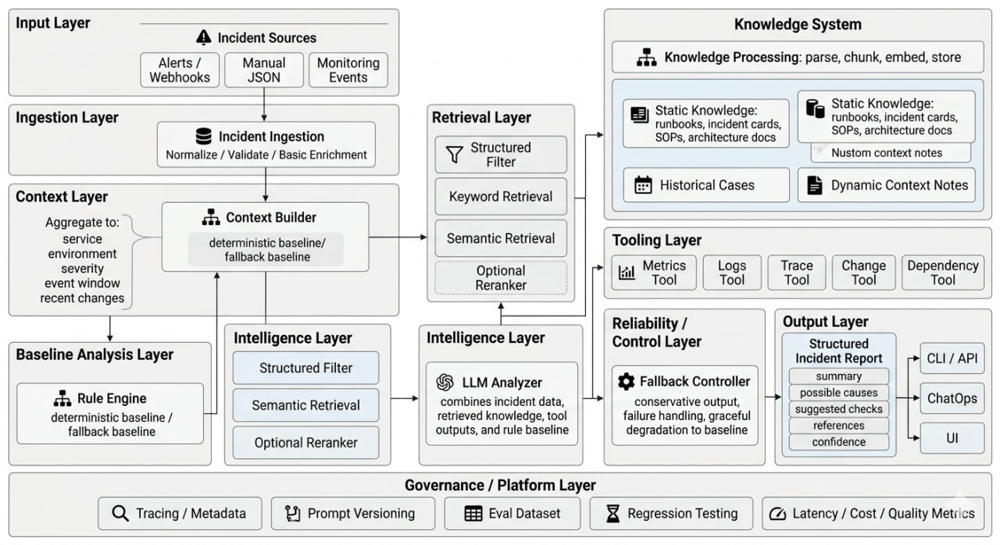

# OpsCopilot

一个面向运维 / SRE 场景的事件分析与排查建议助手。

## 当前阶段

MVP（最小可行版本）

当前目标：
- 使用公开样本或自造样本构建最小事件分析链路
- 输入一条结构化事件
- 输出结构化的初步分析建议
- 为后续接入 RAG、Tool Calling、评测、可观测性做准备

## MVP 定义

OpsCopilot 第一版不是自动修复系统，也不是复杂多 Agent 平台。

第一版只做一件事：

> 输入一条结构化事件，输出结构化分析建议。

### 输入
- 一条结构化事件（incident event）

### 输出
- 事件摘要
- 可能原因
- 建议检查项
- 推荐参考资料
- 置信度

## 当前能力（Week4 Day4）

- `RuleBasedAnalyzer`：稳定基线分析器（默认）
- `LLMAnalyzer`：可控的 LLM 分析器（与 rule 并存，不替换 baseline）
- Week6 Day2 最小 workflow skeleton（轻量 `WorkflowState + WorkflowStep`）
  - 固定链路：`incident -> retrieve -> checks -> final_analysis`
  - `retrieve` / `final_analysis` 直接薄包装复用现有 retriever + generator
  - `checks` 先复用 rule baseline 产出结构化检查项
  - pipeline metadata 新增 `workflow`、`workflow_trace`、`structured_checks` 以增强可观察性
  - 输入基础：incident + knowledge card + rule result
  - 输出仍为同一结构化 schema
  - 当未配置 `OPENAI_API_KEY` 或 LLM 调用异常时，自动回退到 rule 结果
- Week6 Day3（retrieve/checks 两步增强，保持 MVP）
  - `retrieve` step 增加稳定结构化输出（`source/count/refs/path/fallback`）并写入 pipeline metadata
  - `checks` step 输出结构化检查项（`id/title/category/source/refs`），可区分 `rule` / `retrieved_context` / `fallback`
  - 两个步骤都具备 step 级失败兜底：失败时记录 degraded trace 与错误元数据，但 workflow 继续执行
  - pipeline metadata 新增 `retrieve` 与 `checks` 可观察字段，便于判断主路径/降级路径
- Week6 Day4（final synthesis 收口增强，保持 MVP）
  - `final_analysis` step 显式消费 `retrieve/checks` 结构化输入，并把消费边界收敛到 step 内
  - final step metadata 新增 `consumed_inputs` 与 `output_sources`，可直接看出 summary/checks/refs 的主要来源
  - final synthesis 异常时在 step 内降级到 rule fallback，workflow 不中断，并在 trace/metadata 标记 primary/fallback path
- Week6 Day5（workflow observability 统一，保持 MVP）
  - workflow trace 统一字段：`step/status/path_decision/degraded/details`
  - path decision 语义在 retrieve/checks/final 三步对齐（`primary|fallback|continue`）
  - 新增 workflow 级 `overview`（总步数、降级/回退/continue 计数、final path、step 状态/决策视图）
  - pipeline metadata 新增 `workflow_overview` 与 `decisions.checks`，并保持现有字段兼容
- Prompt 模板从代码抽离到文件：
  - `src/opscopilot/prompts/llm_system.txt`
  - `src/opscopilot/prompts/llm_task.txt`
- 最小可观测信息（不影响主输出 schema）：
  - pipeline 保存 `last_run_metadata`
  - `OPSCOPILOT_DEBUG=1` 时将 metadata 输出到 `stderr`
- 支持分析模式切换：`rule | llm`
- 检索模式切换：`local | chroma`
  - `local`：按 `event_type -> docs/cards/<event_type>.md` 读取（原逻辑保留）
  - `chroma`：从 Chroma 检索 `docs/cards/*.md`（每张 card = 一个 document）
  - 检索 query 组合字段：`event_type + title + description + service + environment + symptoms`
  - Chroma 不可用/异常时自动回退到 local retriever
- Retriever metadata 增强（主输出 schema 不变，走 debug metadata）
  - 包含：`mode`、`query/query_summary/query_len`、`retrieved_context_len`、`top_k`、`matched_cards`、`returned_count`、`fallback`、`fallback_reason`
- LLM 输入分层更清晰
  - `incident`
  - `retrieved_context`
  - `rule_result`
  - 通过 `input_layers` 结构显式区分，不再混成单层文本
- Chroma `top_k` 可配置
  - 环境变量：`CHROMA_TOP_K`
  - CLI 参数：`--chroma-top-k`
- Retriever compare 增强（`scripts/compare_retrievers.py`）
  - 样本级 diff 之外，新增差异摘要统计（整体趋势）
  - 支持轻量 `top_k` 参数矩阵（`--top-k-values`）
  - 支持显式 chroma 不可用回退场景（`--simulate-chroma-down`）

## 配置入口与优先级（Week5 Day1）

核心配置项：
- `ANALYSIS_MODE`：`rule | llm`
- `RETRIEVER_MODE`：`local | chroma`
- `CHROMA_TOP_K`：chroma 检索返回条数（必须为正整数）
- `OPENAI_API_KEY`
- `OPENAI_MODEL`
- `OPENAI_BASE_URL`
- `LLM_TIMEOUT_SECONDS`：LLM HTTP 请求超时秒数（默认 `20`，必须 > 0）
- `CHROMA_TIMEOUT_SECONDS`：Chroma HTTP 请求超时秒数（默认 `5`，必须 > 0）
- `LLM_MAX_RETRIES`：LLM 可重试次数（默认 `1`，必须 >= 0）
- `CHROMA_MAX_RETRIES`：Chroma 可重试次数（默认 `1`，必须 >= 0）

优先级（代码内已统一实现，不仅是文档约定）：
- `CLI 参数 > 环境变量 > 默认值`
- 具体体现在 `src/opscopilot/config.py` 的 `resolve_runtime_config()`

常见错误与回退语义：
- **配置无效（直接报错，退出码 2）**
  - 例如：`CHROMA_TOP_K=abc`、`CHROMA_TOP_K<=0`、`CHROMA_PORT` 非法
- **运行期致命异常（直接报错，退出码 3）**
  - 例如：未被 fallback 吸收的 runtime error（stderr 会输出 `[runtime_error]` 或 typed error）
- **能力降级（fallback，不中断主流程）**
  - `ANALYSIS_MODE=llm` 但缺 `OPENAI_API_KEY`：自动回退到 rule 分析器，metadata 中 `fallback_reason=llm_api_key_missing`
  - `RETRIEVER_MODE=chroma` 但 Chroma 服务不可达：自动回退到 local retriever，metadata 中 `fallback=true` + `error_type=external_dependency_error`

Week5 Day2 新增错误语义（metadata 级）：
- `config_error`
- `external_dependency_error`
- `retrieval_empty`
- `llm_call_failed`
- `output_parse_failed`

Week5 Day3 timeout/retry 语义（metadata 级，非黑盒）：
- metadata 新增：`retry_count`、`retried`、`max_retries`
- **会重试（有界）**：
  - Chroma `external_dependency_error`（网络/HTTP 临时失败）
  - LLM `llm_call_failed` 中可判定为临时失败的子类（例如 timeout / 429 / 5xx / 连接中断）
- **不会重试**：
  - `config_error`
  - `output_parse_failed`
  - 非临时型 `llm_call_failed`（如请求参数错误）
- 重试后仍失败：保持原有错误分类；若进入 fallback，metadata 会同时体现 `retry_count>0` 与 fallback 字段。

Week5 Day4 fallback 语义收口（metadata 级）：
- retriever / generator 统一补充：
  - `fallback`、`fallback_from`、`fallback_to`、`fallback_reason`、`fallback_after_retry`
  - `path_decision`（统一结构）：`action(primary|fallback|continue)` + `from/to/reason/after_retry`
- `retrieval_empty` 场景不再混入 fallback，统一表达为 `path_decision.action=continue`。
- pipeline 增加聚合态：
  - `had_fallback`、`fallback_count`
  - `had_retry`、`total_retry_count`
  - `primary_path`（计划路径）与 `effective_path`（实际生效路径）

主流程运行态（`pipeline.run_status`）：
- `success`：成功且无降级
- `degraded_success`：发生 fallback，但主流程可继续
- `empty_retrieval_continue`：检索为空，走 continue 路径并继续输出分析

典型场景：
- **`ANALYSIS_MODE=llm` 且缺 `OPENAI_API_KEY`**
  - `run_status=degraded_success`
  - generator metadata：`fallback=true`、`fallback_from=llm`、`fallback_to=rule`、`fallback_reason=llm_api_key_missing`
  - pipeline metadata：`had_fallback=true`，`effective_path` 显示 `generator:rule`
- **`RETRIEVER_MODE=chroma` 且 Chroma 不可达**
  - retriever metadata：`fallback=true`、`fallback_from=chroma`、`fallback_to=local`、`fallback_reason=chroma_unavailable`
  - 若重试后才回退，`fallback_after_retry=true` 且 `retry_count>0`

## 本地运行

```bash
cd /Users/louyuguang/.openclaw/workspace/projects/OpsCopilot
export PYTHONPATH=src
python src/main.py --event samples/incidents/high_cpu.json --mode rule
```

LLM 模式（先准备环境变量）：

```bash
cp .env.example .env
# 编辑 .env 注入真实 OPENAI_API_KEY（不要提交）
export $(grep -v '^#' .env | xargs)
python src/main.py --event samples/incidents/high_cpu.json --mode llm
```

也可用环境变量控制默认模式：

```bash
export ANALYSIS_MODE=llm
python src/main.py --event samples/incidents/high_cpu.json
```

检索模式切换（默认 local）：

```bash
# local（不依赖 Chroma）
python src/main.py --event samples/incidents/high_cpu.json --retriever local

# chroma（失败会自动 fallback 到 local）
python src/main.py --event samples/incidents/high_cpu.json --retriever chroma

# 或环境变量
export RETRIEVER_MODE=chroma
python src/main.py --event samples/incidents/high_cpu.json

# 控制 Chroma Top-K（环境变量优先级同默认值）
export CHROMA_TOP_K=5
python src/main.py --event samples/incidents/high_cpu.json --retriever chroma

# 或命令行直接覆盖
python src/main.py --event samples/incidents/high_cpu.json --retriever chroma --chroma-top-k 2
```

可观测调试（stderr）：

```bash
export OPSCOPILOT_DEBUG=1
python src/main.py --event samples/incidents/high_cpu.json --mode llm
```

## 构建 Chroma cards 索引（最小版）

> 当前最小实现：`docs/cards/*.md` 每个文件作为一个 document 写入 Chroma。

```bash
export PYTHONPATH=src
export CHROMA_HOST=localhost
export CHROMA_PORT=18000
export CHROMA_COLLECTION=opscopilot_cards_v1
python src/build_chroma_index.py
```

预期输出类似：

```json
{"indexed_cards": 5, "collection": "opscopilot_cards_v1", "chroma": "localhost:18000"}
```

## 测试

```bash
export PYTHONPATH=src
python -m unittest discover -s tests
```

最小验证建议（local vs chroma）：

```bash
# 1) baseline local 不变（覆盖 high_cpu/high_memory/mysql_too_many_connections）
python src/main.py --event samples/incidents/high_cpu.json --mode rule --retriever local
python src/main.py --event samples/incidents/high_memory.json --mode rule --retriever local
python src/main.py --event samples/incidents/mysql_too_many_connections.json --mode rule --retriever local

# 2) 先建索引，再走 chroma（同样覆盖 3 个样本）
python src/build_chroma_index.py
python src/main.py --event samples/incidents/high_cpu.json --mode rule --retriever chroma
python src/main.py --event samples/incidents/high_memory.json --mode rule --retriever chroma
python src/main.py --event samples/incidents/mysql_too_many_connections.json --mode rule --retriever chroma

# 3) 人为把 CHROMA_PORT 改错，验证 fallback 到 local
CHROMA_PORT=1 python src/main.py --event samples/incidents/high_cpu.json --retriever chroma

# 4) 一键对比报告（输出 local/chroma 差异 + retriever metadata + 差异摘要统计）
python scripts/compare_retrievers.py

# 5) 轻量 top_k 参数矩阵比较（例如 1/3/5）
python scripts/compare_retrievers.py --top-k-values 1,3,5

# 6) compare 流程中显式展示 chroma 不可用回退场景
python scripts/compare_retrievers.py --simulate-chroma-down

# 7) 产出可落盘评测工件（建议放 reports/）
python scripts/compare_retrievers.py --output-json reports/compare/latest.json

# 8) 本次 vs 上次趋势比较 + 阈值提醒
python scripts/compare_retrievers.py \
  --baseline-json reports/compare/prev.json \
  --output-json reports/compare/latest.json \
  --warn-threshold 2

# 9) 当触发 warning 时在 CI 中返回非 0（可选）
python scripts/compare_retrievers.py \
  --baseline-json reports/compare/prev.json \
  --output-json reports/compare/latest.json \
  --warn-threshold 2 \
  --fail-on-warn

# 10) 推荐 CI / regression 命令模板（含精简摘要 + baseline 严格校验）
python scripts/compare_retrievers.py \
  --baseline-json reports/compare/prev.json \
  --output-json reports/compare/latest.json \
  --summary-json reports/compare/latest-summary.json \
  --warn-threshold 2 \
  --fail-on-warn \
  --strict-baseline
```

`compare_retrievers.py` 现在支持三层输出：

1) 样本级可读 diff（原有）
- `recommended_refs`：local_only / chroma_only
- `possible_causes`：local_only / chroma_only
- `suggested_checks`：local_only / chroma_only
- metadata 快速对照：`query_len`、`retrieved_context_len`、`top_k`、`returned_count`、`fallback`

2) 差异摘要统计（新增）
- `recommended_refs_diff_count`
- `possible_causes_diff_count`
- `suggested_checks_diff_count`
- `summary_equal_true_count` / `summary_equal_false_count`

3) 机器可读 JSON（`JSON_REPORT`）
- 保留每个样本/每个对比对的明细
- 追加 `comparisons[].summary` 聚合统计，便于后续自动化处理
- 增加 `meta` 轻量元信息，包含：`run_timestamp`、`run_epoch`、`git_commit`、`args`（samples/top_k_values/simulate_chroma_down/warn_threshold/fail_on_warn/strict_baseline 等）
- baseline 对比覆盖统计写入 `baseline_coverage`：`baseline_missing_count`、`comparison_missing_in_baseline_count`（以及对应 name 列表）
- 可通过 `--output-json reports/compare/latest.json` 落盘（自动创建父目录）

4) 精简机器可读摘要（`--summary-json`）
- 单独输出关键字段：`warnings`、`baseline_coverage`、`trend_vs_baseline`、`summary` 聚合视图
- 提供 `exit` 语义字段（strict-baseline / fail-on-warn 的触发信息），便于 CI 直接判定
- 可通过 `--summary-json reports/compare/latest-summary.json` 落盘（自动创建父目录）

额外能力（Day4+Day6）：
- 轻量参数矩阵：`--top-k-values 1,3,5`（按 `local vs chroma_top_k_*` 逐组对比）
- fallback compare 可见性：`--simulate-chroma-down`（在报告中单独加入 `local_vs_chroma_fallback`）
- baseline 趋势对比：`--baseline-json <prev_report>`，输出 `trend_vs_baseline`（含关键聚合指标 delta）
- baseline 覆盖统计：输出 `baseline_coverage`（`baseline_missing_count`、`comparison_missing_in_baseline_count`）并在人类可读结果中展示
- 阈值提醒：`--warn-threshold <n>`，当 diff count 超阈值时在人类可读输出中给出 WARNING，JSON 同步写入 `warnings`
- 可选阻断开关：`--fail-on-warn`，仅在有 warning 时返回非 0（exit code 2）；默认不加该参数仍返回 0（非阻断）
- baseline 严格校验：`--strict-baseline`，当 baseline 覆盖存在缺口（`baseline_missing_count > 0` 或 `comparison_missing_in_baseline_count > 0`）时返回非 0（exit code 3）
- CI 精简摘要：`--summary-json <path>`，输出可直接被 CI / regression 读取的关键字段（自动创建父目录）

## 场景矩阵回归（Week5 Day6：baseline compare + 最小 gate）

脚本：`scripts/scenario_matrix_regression.py`

用途：把 Day1~Day4 的配置/错误语义/重试与 fallback 聚合语义，固化成固定 case 的轻量回归资产，并提供 baseline 对比与最小 gate 能力。

### 1) 仅跑 scenario regression（生成 latest）

```bash
export PYTHONPATH=src
python scripts/scenario_matrix_regression.py
# 或指定落盘位置
python scripts/scenario_matrix_regression.py --output-json reports/eval/scenario-matrix-latest.json
```

### 2) 与 baseline 对比（生成 diff）

```bash
# 假设 baseline 已存在
python scripts/scenario_matrix_regression.py \
  --output-json reports/eval/scenario-matrix-latest.json \
  --baseline-json reports/eval/scenario-matrix-baseline.json \
  --diff-json reports/eval/scenario-matrix-diff.json
```

建议工件命名：
- `reports/eval/scenario-matrix-latest.json`
- `reports/eval/scenario-matrix-baseline.json`
- `reports/eval/scenario-matrix-diff.json`

### 3) warning / fail gate 语义

```bash
python scripts/scenario_matrix_regression.py \
  --output-json reports/eval/scenario-matrix-latest.json \
  --baseline-json reports/eval/scenario-matrix-baseline.json \
  --diff-json reports/eval/scenario-matrix-diff.json \
  --warn-threshold 0 \
  --fail-on-warn
```

- `warnings`：diff 中的结构化告警列表（包含 case 缺失、字段变化）
- `summary.warning_count`：warning 总数
- `--warn-threshold <n>`：当 `warning_count > n` 时，`gate.warn_triggered=true`
- `--fail-on-warn`：若 `warn_triggered=true`，进程返回非 0（exit code 2）；否则返回 0

### 默认覆盖 case
- `llm_key_missing`
- `llm_call_failed_after_retry`
- `chroma_down`
- `retrieval_empty`

### case 对比关键字段（latest vs baseline）
- `run_status`
- `had_fallback`
- `fallback_count`
- `had_retry`
- `total_retry_count`
- `primary_path`
- `effective_path`
- `path_decision`
- `error_type`

### 输出工件核心结构
- latest（`scenario-matrix-latest.json`）
  - case 级：`run_status`、`had_fallback`、`fallback_count`、`had_retry`、`total_retry_count`
  - 路径级：`primary_path`、`effective_path`
  - 错误/决策：`error_type`、`path_decision`（并保留 `decisions` 原始聚合）
- diff（`scenario-matrix-diff.json`）
  - `compare_fields`
  - `cases[case].status` + `cases[case].field_diffs`
  - `warnings`
  - `summary.warning_count`
  - `gate`（`warn_threshold` / `fail_on_warn` / `warn_triggered` / `should_fail` / `exit_code`）

与 compare / regression gate 的关系：
- 该入口聚焦“固定语义场景是否还成立”，输出结构稳定、可直接供 CI 或 compare 脚本读取。
- 与 `compare_retrievers.py` 互补：
  - `compare_retrievers.py` 关注 local/chroma 结果差异趋势
  - `scenario_matrix_regression.py` 关注错误语义 + 决策路径语义是否稳定

### baseline 更新策略（最小可执行约定）

目标：既能吸收“预期变化”，又避免 baseline 漂移把真实回归掩盖掉。

1) 什么时候更新 baseline
- 仅在以下条件同时满足时更新：
  - 变更已通过 code review；
  - `scenario_matrix_regression.py` 的 diff 已人工确认“变化符合预期”；
  - 该变化属于“语义升级/设计调整”，不是偶发波动。
- 不在“为了让 CI 变绿”时直接覆盖 baseline。

2) 谁/如何更新
- 谁：默认由提交该语义变更的 owner 更新，reviewer 二次确认。
- 如何（建议固定命令）：

```bash
export PYTHONPATH=src
python scripts/scenario_matrix_regression.py \
  --output-json reports/eval/scenario-matrix-latest.json \
  --baseline-json reports/eval/scenario-matrix-baseline.json \
  --diff-json reports/eval/scenario-matrix-diff.json

# 人工确认 diff 后再覆盖 baseline
cp reports/eval/scenario-matrix-latest.json reports/eval/scenario-matrix-baseline.json
```

3) 如何避免 baseline 漂移
- baseline 更新与代码变更放在同一个 PR，且在 PR 描述里列出：`changed case` / `changed fields` / `原因`。
- 对“已知可接受但短期不想改 baseline”的变化，优先用白名单而非直接改 baseline：
  - `--allow-field-change case:field`
- 周内最多一次批量 baseline 更新（除紧急修复外），避免碎片化漂移。

### diff / gate 人类可读摘要（Day7 收口）

在 baseline compare 模式下，脚本会额外输出 `SCENARIO_MATRIX_DIFF_SUMMARY`，快速展示：
- changed case 数
- warning 列表（case + field + baseline/latest）
- allowed change 列表
- gate 结果（warn_triggered / should_fail / exit_code）

示例命令：

```bash
python scripts/scenario_matrix_regression.py \
  --output-json reports/eval/scenario-matrix-latest.json \
  --baseline-json reports/eval/scenario-matrix-baseline.json \
  --diff-json reports/eval/scenario-matrix-diff.json \
  --warn-threshold 0 \
  --fail-on-warn \
  --allow-field-change llm_key_missing:had_fallback
```

### `--allow-field-change` 最小白名单机制（Day7）

用途：允许少量“已知且可接受”的字段变化不再持续触发 gate 阻断。

- 参数可重复：`--allow-field-change case:field`
- 被允许的变化会进入 diff artifact 的 `allowed_changes`
- 这类变化不会计入 `warnings`，也不会触发 `fail-on-warn`
- 仍保留审计可见性（`summary.allowed_change_count` + `cases[].allowed_field_diffs`）

示例：

```bash
python scripts/scenario_matrix_regression.py \
  --baseline-json reports/eval/scenario-matrix-baseline.json \
  --allow-field-change llm_key_missing:had_fallback \
  --allow-field-change chroma_down:total_retry_count
```

## Week5 工程化收口总结（Day1~Day7）

Week5 已完成并串联为可交付链路：
- Day1: 配置入口统一（CLI > ENV > 默认）+ typed config 校验
- Day2: 错误语义标准化（`config_error` / `external_dependency_error` / `retrieval_empty` / `llm_call_failed` / `output_parse_failed`）
- Day3: timeout/retry 明确语义与 metadata
- Day4: fallback 语义统一 + pipeline 聚合态（`run_status` / `had_fallback` / `had_retry` / `effective_path`）
- Day5: compare 报告能力增强（trend/warning/fail gate/summary artifact）
- Day6: scenario matrix regression + baseline compare + 最小 gate
- Day7: baseline 更新策略 + 人类可读 diff 摘要 + 最小变化白名单机制

如何理解关键字段：
- `run_status`：主流程结果态（success/degraded_success/empty_retrieval_continue）
- `had_fallback` / `fallback_count`：是否及发生了多少次降级
- `had_retry` / `total_retry_count`：是否及累计重试次数
- `path_decision` / `effective_path`：本次最终走了哪条语义路径
- diff/gate：基于 scenario baseline 对比得到的结构化 warning 与阻断结论

## Docker

构建镜像：

```bash
docker build -t opscopilot:day6 .
```

rule 模式运行：

```bash
docker run --rm opscopilot:day6
```

llm 模式运行：

```bash
docker run --rm \
  -e ANALYSIS_MODE=llm \
  -e OPENAI_API_KEY=your_key \
  -e OPENAI_MODEL=sub2api/gpt-5.4 \
  -e OPENAI_BASE_URL=https://api.openai.com/v1 \
  opscopilot:day6
```

## Docker Compose

```bash
cp .env.example .env
# 编辑 .env 填入 API key / base URL / model

docker compose up --build
```

覆盖一次性模式（例如切到 llm）：

```bash
ANALYSIS_MODE=llm docker compose up --build
```

## Target Architecture

> 下面这张图是 OpsCopilot 的**目标态架构图**（planned / target architecture），不是当前所有能力都已完成的现状图。
>
> 当前 MVP 已经实现的部分主要包括：本地 incident 输入、LocalCardRetriever、RuleBasedAnalyzer、LLMAnalyzer、结构化 JSON 输出、Docker / docker-compose 运行、最小测试与 debug metadata。检索索引、embedding、向量存储、reranker、更多工具系统等属于后续演进方向。



## 当前目录

```text
OpsCopilot/
  README.md
  docker-compose.yml
  docs/
    cards/
  samples/
    incidents/
  schemas/
  src/
    opscopilot/
      prompts/
  tests/
```
